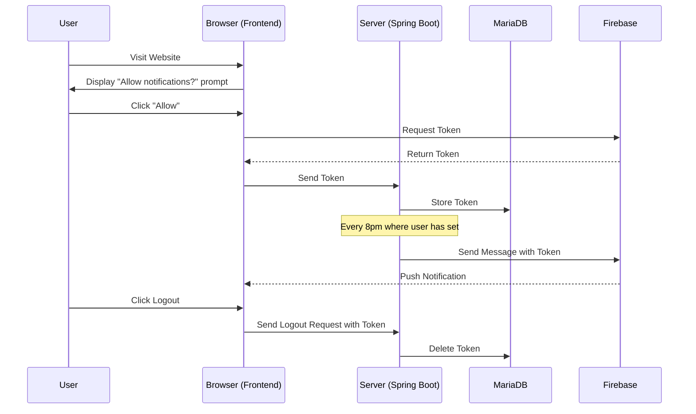
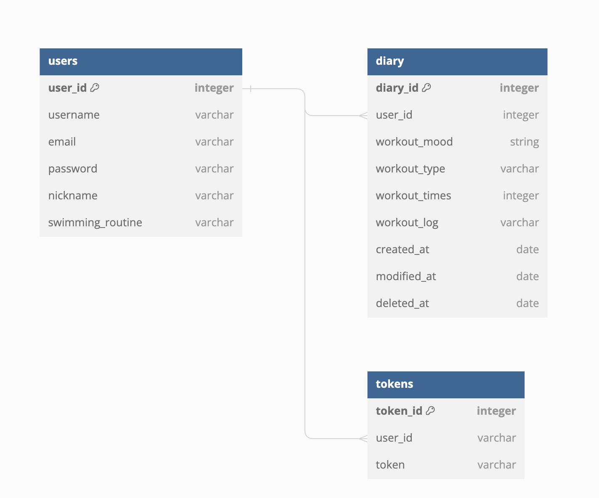

# :swimmer: 수영 감정 일기

## 개요

- 시중에 운동에 관련된 기록을 제공하는 서비스는 많은데, 주로 운동 기록 자체 (세부 운동에 대한 기록)에 초점이 맞춰져 있는 경우가 있어 기록에 집중하게 되는 경향이 있습니다.
- 수영과 같이 혼자 하는 운동을 하는 사람들에게 운동을 계속해서 지속할 수 있게 하는 동기는 성취감이라는 아이디어에 기반을 둬 운동 했을 때 느낀 기분을 기록하고, 회고하는 것을
  질문에 기반을 둬 사용자가 작성할 수 있도록 돕는 서비스입니다.

## 구현 기능

- 회원가입 기능
    - 사용자는 회원가입 후 사용할 수 있다.
    - 회원가입시 아이디, 비밀번호, 닉네임, 운동 주기를 입력하고 아이디와 닉네임은 중복될 수 없다.
- 로그인, 로그아웃 기능
    - 로그인한 경우에만 사용할 수 있다.
    - 기본 로그인은 JWT 기반으로 제공한다.
    - 사용자는 OAuth로 로그인할 수 있다. (구글 로그인 제공)
- 운동 감정 기록 작성 기능
    - 사용자는 운동 감정을 선택할 수 있다. (필수 항목)
        - 운동 감정은 사용자는 운동 후에 느낄 수 있는 감정의 단어들로 구성된 이모지 중 선택할 수 있다.
        - 운동 감정의 종류 : 뿌듯한, 가벼운, 기운이 나는, 재미있는, 용기 나는
    - 운동 기록 작성 기능
        - 어떤 운동을 했는지 선택할 수 있다. (접영, 배영, 평영, 자유형 중 복수 선택)
        - 선택한 영법의 횟수를 숫자로 기록할 수 있다. (eg. 2바퀴)
    - 회고 작성 기능
        - 그 외에 작성하고 싶은 내용이 있다면 입력할 수 있도록 제공 (텍스트)
    - 기록 수정, 삭제 기능
        - 사용자는 작성한 기록을 수정하고 삭제할 수 있다.
    - 모든 기록은 DATE 형태로 저장 일시가 자동 저장된다.
- 운동 감정기록 모아보기 기능 (리포트 기능)
    - 사용자는 해당 월의 운동 감정별 기록을 조회할 수 있다.
    - 감정 기록 모아보기를 했을때 한달 기준 최대 31개의 데이터가 조회된다.
    - pagenation 기반으로 데이터가 제공되며, 운동 감정 별 최대 10개의 데이터가 노출된다.
- 이전 기록 날짜별 조회 기능
    - 사용자는 원하는 날짜의 운동 기분 기록을 조회할 수 있으며 선택한 일자에 대한 기록만 제공한다.
    - 최대 2년 전 기록까지 조회할 수 있다.
- 웹 푸시 기능
    - 목적 : 사용자에게 알림을 통해 운동 감정 기록을 독려한다.
    - 회원가입시 입력한 운동 주기 요일에 오후 8시에 알림을 전송한다.
    - Firebase Cloud Messaging(FCM) 기반으로 구현

  ### 웹 푸시 알림 Flow

## ERD

## WBS

[개발계획서 확인하기](https://docs.google.com/spreadsheets/d/18YZ0-OuTypVbIbnMl6kPdKGM3txDf3VCotl0mbziRT8/edit?gid=2096235861#gid=2096235861)

## Trouble Shooting
TBD

## Tech Stack

 
  
   
  
  
  

