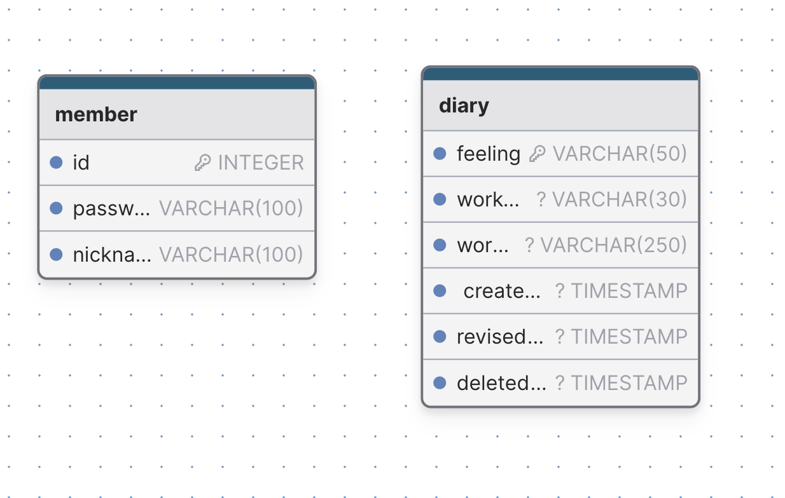

# :swimmer: 수영 기분 일기

## 개요

- 시중에 운동에 관련된 기록을 제공하는 서비스는 많은데, 주로 운동 기록 자체 (세부 운동에 대한 기록)에 초점이 맞춰져 있는 경우가 있어 기록에 집중하게 되는 경향이 있습니다.
- 수영 같이 혼자하는 운동을 하는 사람들에게 운동을 계속해서 지속할 수 있게 하는 동기는 성취감이라는 아이디어에 기반해 운동 했을때 느낀 기분을 기록하고, 회고하는 것을 질문에 기반해 사용자가 작성할 수 있도록 돕는 서비스 입니다.

## 구현 기능

- 회원가입 기능
    - 사용자는 회원가입 후 사용할 수 있다.
    - 회원가입시 아이디, 비밀번호, 닉네임, 운동 주기, 알람시간을 입력하고, 아이디와 닉네임은 중복될 수 없다.
- 로그인, 로그아웃 기능
    - 로그인한 경우에만 사용할 수 있다.
    - OAuth로 로그인 할 수 있다.
- 운동 기분 작성 기능
    - 사용자는 운동 기분을 선택할 수 있다.
    - 운동 기록 작성 기능
        - 어떤 운동을 했는지 기록할 수 있다. (접영, 배영, 평영, 자유형 중 선택)
    - 회고 작성 기능
        - 그 외에 작성하고 싶은 내용이 있다면 입력할 수 있도록 제공 (텍스트)
    - 작성한 기록은 기록 수정하고 삭제할 수 있다.
    - TIMESTAMP 형태로 저장 일시, 시간이 자동으로 저장된다
- 기분별 기록 모아보기 기능 제공(리포트 기능)
    - 해당 월의 기분 별 기록을 조회할 수 있다.
- 날짜 클릭하면 해당 날짜의 기록 조회 기능
    - 원하는 날짜의 운동 기분 기록을 조회할 수 있으며, 최대 2년까지 조회할 수 있다.
- 웹 푸시 기능
    - 사용자에게 오늘의 운동기분을 작성할 시간이에요 알림을 통해 회고 작성을 독려한다.

## ERD
